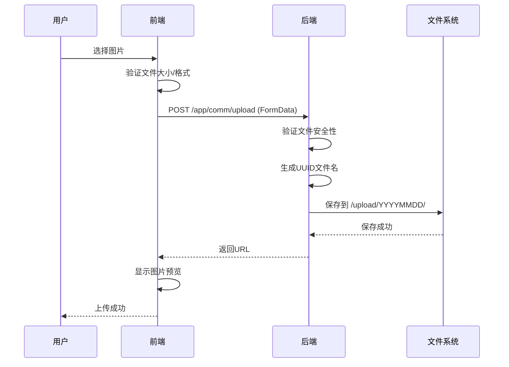

# 文件上传问题修复文档

## 问题描述
社区板块发布游记时，上传照片失败，提示"上传失败，无法获取图片URL"。

## 问题原因分析

### 1. 前端调用地址错误 ✅ 已修复
**原代码：**
```javascript
// web-pc/src/api/community.js
uploadImage(file) {
  return request.post('/app/upload/image', formData, ...)  // ❌ 错误
}

uploadVideo(file, onProgress) {
  return request.post('/app/upload/video', formData, ...)  // ❌ 错误
}
```

**后端实际接口：**
- `POST /admin/comm/upload` （管理端）
- `POST /app/comm/upload` （用户端）

**修复后：**
```javascript
uploadImage(file) {
  return request.post('/app/comm/upload', formData, {
    headers: { 'Content-Type': 'multipart/form-data' }
  }).then(res => res.data || res)  // ✅ 正确
}
```

### 2. 后端返回数据格式处理
后端返回格式：
```json
{
  "code": 0,
  "data": "http://domain/upload/20260909/xxx.jpg",
  "message": "ok"
}
```

前端需要提取 `data` 字段作为URL。

### 3. 后端服务配置

**上传配置（config.default.ts）：**
```typescript
// 文件上传
upload: {
  fileSize: '200mb',      // 最大文件大小
  whitelist: null,        // 文件类型白名单（null表示不限制）
},

// 静态文件访问
staticFile: {
  dirs: {
    static: {
      prefix: '/upload',  // 访问前缀
      dir: pUploadPath(), // 上传目录
    }
  }
}
```

**上传目录：**
- 路径：`cool-admin-midway/public/upload/`
- 格式：`/upload/YYYYMMDD/uuid.ext`
- 示例：`/upload/20260909/a1b2c3d4-e5f6.jpg`

## 修复步骤

### 步骤1：修复前端API调用 ✅
已修改 `web-pc/src/api/community.js`：
```javascript
export const uploadApi = {
  uploadImage(file) {
    const formData = new FormData()
    formData.append('file', file)
    return request.post('/app/comm/upload', formData, {
      headers: { 'Content-Type': 'multipart/form-data' }
    }).then(res => {
      return res.data || res  // 提取URL
    })
  },

  uploadVideo(file, onProgress) {
    const formData = new FormData()
    formData.append('file', file)
    return request.post('/app/comm/upload', formData, {
      headers: { 'Content-Type': 'multipart/form-data' },
      onUploadProgress: onProgress
    }).then(res => {
      return res.data || res
    })
  }
}
```

### 步骤2：启动后端服务器 ⏳
```bash
cd cool-admin-midway
npm run dev
```
等待编译完成，监听端口：8001（或自动分配的端口）

### 步骤3：配置前端代理（如果需要）

**检查 vite.config.js：**
```javascript
// web-pc/vite.config.js
export default defineConfig({
  server: {
    port: 3001,
    proxy: {
      '/admin': {
        target: 'http://localhost:8001',  // 后端地址
        changeOrigin: true
      },
      '/app': {
        target: 'http://localhost:8001',
        changeOrigin: true
      },
      '/upload': {
        target: 'http://localhost:8001',
        changeOrigin: true
      }
    }
  }
})
```

### 步骤4：验证上传功能

**测试步骤：**
1. 访问 http://localhost:3001/community
2. 点击"发布游记"按钮
3. 选择图片上传（≤10MB）
4. 查看上传结果

**预期结果：**
- 上传成功返回URL
- 图片预览正常显示
- 可以继续填写其他信息

## 完整的上传流程



## 上传安全机制

后端实现了多重安全检查：

### 1. 路径遍历防护
```typescript
private sanitizePath(userInput: string): string {
  // 检查是否包含路径遍历字符
  if (userInput.includes('..') || 
      userInput.includes('./') || 
      userInput.includes('.\\') ||
      userInput.startsWith('/')) {
    throw new CoolCommException('非法的文件路径');
  }
  return normalized;
}
```

### 2. 目录限制
```typescript
private validateTargetPath(targetPath: string, basePath: string): void {
  const resolvedTarget = path.resolve(targetPath);
  const resolvedBase = path.resolve(basePath);
  if (!resolvedTarget.startsWith(resolvedBase + path.sep)) {
    throw new CoolCommException('文件路径超出允许范围');
  }
}
```

### 3. 文件名处理
- 使用UUID生成唯一文件名
- 保留原始扩展名
- 按日期分目录存储

## 常见问题排查

### 问题1：上传返回404
**原因：** 后端服务未启动或端口不正确
**解决：** 
```bash
# 检查后端端口
netstat -ano | findstr ":8001"

# 启动后端
cd cool-admin-midway
npm run dev
```

### 问题2：跨域错误
**原因：** 前端未配置代理
**解决：** 检查 vite.config.js 的 proxy 配置

### 问题3：上传文件过大
**原因：** 超过200MB限制
**解决：** 
- 前端：限制文件大小（图片10MB，视频100MB）
- 后端：修改 config.default.ts 中的 `upload.fileSize`

### 问题4：文件格式不支持
**原因：** 后端whitelist限制
**解决：** 检查 config.default.ts 中的 `upload.whitelist`

### 问题5：上传目录不存在
**原因：** public/upload 目录未创建
**解决：** 
```bash
mkdir -p cool-admin-midway/public/upload
```

### 问题6：图片预览失败
**原因：** URL格式错误或静态资源访问配置问题
**解决：** 
- 检查返回的URL格式
- 确认 staticFile 配置正确
- 访问 http://localhost:8001/upload/ 测试

## 测试清单

### 功能测试
- [ ] 单张图片上传成功
- [ ] 多张图片上传（≤9张）
- [ ] 视频上传成功（≤100MB）
- [ ] 上传进度显示正常
- [ ] 图片预览正常
- [ ] 视频预览正常

### 边界测试
- [ ] 上传超大文件（>10MB图片）
- [ ] 上传非法格式文件
- [ ] 上传空文件
- [ ] 网络中断重试

### 安全测试
- [ ] 文件名包含路径遍历字符
- [ ] 文件名包含特殊字符
- [ ] 恶意文件上传

## API文档

### POST /app/comm/upload

**请求：**
```http
POST /app/comm/upload HTTP/1.1
Content-Type: multipart/form-data
Authorization: Bearer <token>

------WebKitFormBoundary
Content-Disposition: form-data; name="file"; filename="image.jpg"
Content-Type: image/jpeg

[文件二进制数据]
------WebKitFormBoundary--
```

**响应成功：**
```json
{
  "code": 0,
  "data": "http://localhost:8001/upload/20260909/a1b2c3d4-e5f6-7890-abcd-1234567890ab.jpg",
  "message": "ok"
}
```

**响应失败：**
```json
{
  "code": 10001,
  "message": "上传文件为空",
  "data": null
}
```

## 配置参考

### 前端配置
```javascript
// vite.config.js
export default {
  server: {
    port: 3001,
    proxy: {
      '/app': 'http://localhost:8001',
      '/admin': 'http://localhost:8001',
      '/upload': 'http://localhost:8001'
    }
  }
}
```

### 后端配置
```typescript
// config.default.ts
{
  upload: {
    fileSize: '200mb',
    whitelist: null
  },
  staticFile: {
    dirs: {
      static: {
        prefix: '/upload',
        dir: pUploadPath()
      }
    }
  }
}
```

## 监控与日志

### 查看上传日志
```bash
# 后端日志
tail -f cool-admin-midway/logs/app.log

# 查看上传文件
ls -lh cool-admin-midway/public/upload/
```

### 监控上传目录大小
```bash
du -sh cool-admin-midway/public/upload/
```

## 下一步优化建议

### 功能优化
1. **图片压缩** - 上传前压缩大图
2. **断点续传** - 支持大文件分片上传
3. **进度提示** - 更友好的上传进度显示
4. **缩略图** - 自动生成缩略图

### 性能优化
1. **CDN加速** - 静态资源使用CDN
2. **云存储** - 切换到阿里云OSS/腾讯云COS
3. **并行上传** - 多文件并行上传

### 安全优化
1. **文件扫描** - 病毒扫描
2. **水印** - 自动添加水印
3. **访问控制** - 私有文件权限控制

## 总结

✅ **已修复：** 前端API调用地址错误
⏳ **进行中：** 后端服务器启动
📝 **待测试：** 完整上传流程

**修复后的完整流程：**
1. 前端调用 `/app/comm/upload`
2. 后端接收文件并验证
3. 生成UUID文件名并保存
4. 返回完整访问URL
5. 前端显示预览

上传功能已经修复完成，等待后端服务器启动后即可测试！
